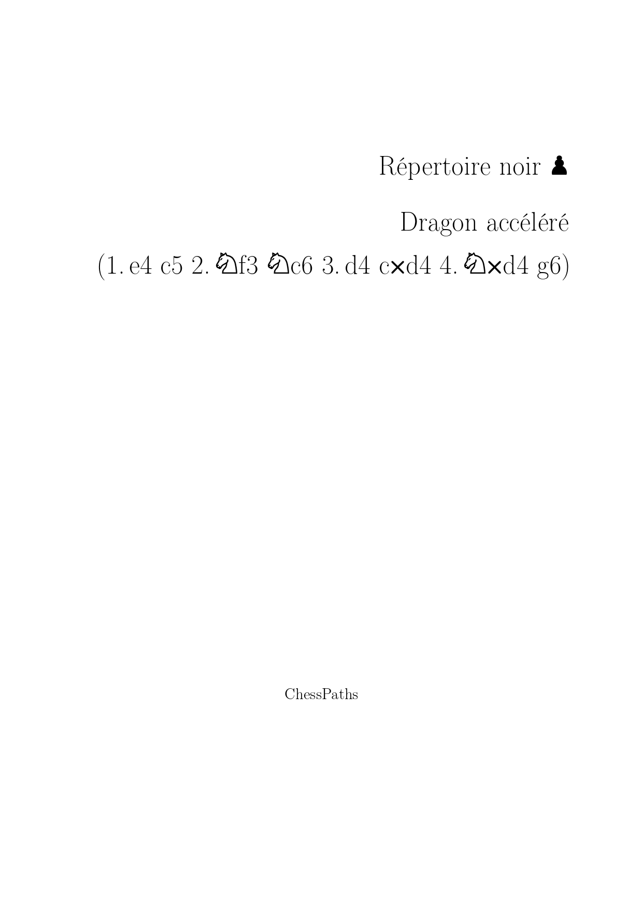
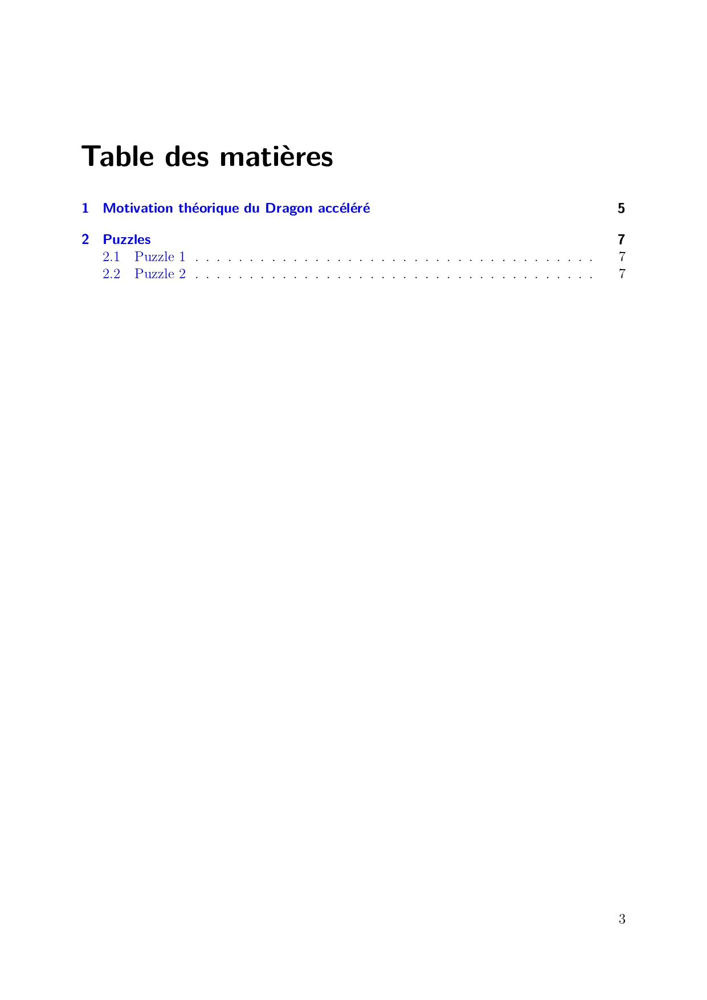
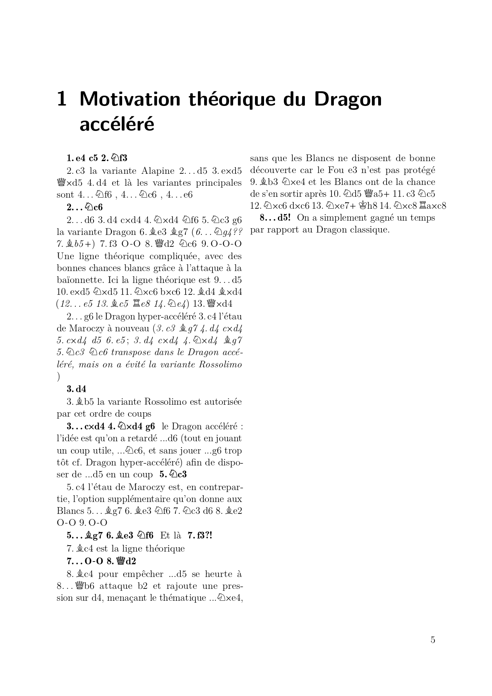
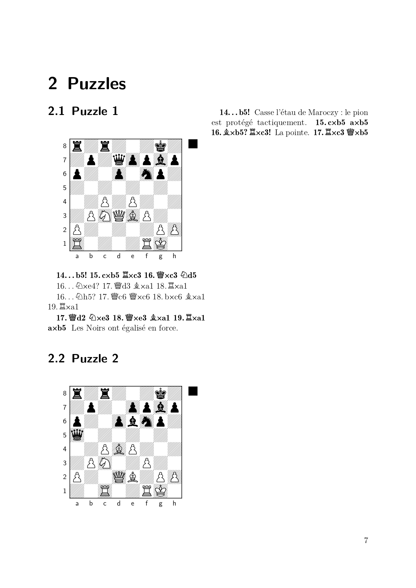

# ChessPaths

ChessPaths is a program intended to convert PGNs and LaTex projects into
PGNs or LaTeX projects, 
optionally merging the games for a specified granularity level.

For a direct usage of the program, go to [Documentation](#Documentation).
For working on the Python code, go to 
[Installation of the Python project](#installation-of-the-python-project).
You can also find an [Introduction to LaTeX and xskak](#introduction-to-latex-and-xskak).

## Documentation

### Installation

On the [GitHub page of the project](https://github.com/PaulMouret/chesspaths),
go to Releases. Select the latest release and, from its assets,
download the program corresponding to your operating system.

### Main features

The following operations are supported :

- `PGN(s) ⟶ PGN` :
out of 1 PGN file, or 1 PGN folder,
  creates 1 PGN file.

- `PGNs ⟶ PGNs (1 per original PGN)` :
out of 1 PGN folder, creates 1 PGN file for each PGN file in the folder.

- `LaTeX chapter ⟶ PGN` :
out of 1 LaTeX file, creates 1 PGN file.

- `LaTeX project ⟶ PGNs (1 per chapter)` :
out of 1 LaTeX project, creates 1 PGN file for each LaTex file in the folder.

- `LaTeX project ⟶ LaTeX project` :
out of 1 LaTeX project, creates 1 LaTeX project.

- `PGN(s) ⟶ LaTeX project` :
out of 1 PGN file, or 1 PGN folder, creates one LaTeX project.

### Details

Given an input game, the program outputs the corresponding text in the given format.
So, besides the possible merging operations, 
converting PGN(s) into PGN(s), or a LaTex project into a LaTeX project,
serves as standardization. In particular, PGNs may be formatted in a variety of ways,
that are not always supported by chess softwares : the present program enables to perform
a preliminary cleaning of PGNs, and similarly for the LaTeX projects.

By "PGN folder", I mean a folder containing several PGNs ; 
note that given a folder the program recursively scans the folder 
(that is to say it also searches into nested subfolders).

An input LaTeX project is expected to be a folder containing one folder 
for each chapter : from there the program recursively scans the chapter folder,
so the chapter folder may be organized in various ways.
For instance, the following project structure is supported :
```text
project_name/
├── main.tex
├── chapter_1/
│   └── ...
└── chapter_2/
    └── ...
```
Conversely, the LaTeX projects output by the program have the following structure :
```text
project_name/
├── main.tex
├── chapter_1/
│   └── chapter_1.tex
├── chapter_2/
│   └── chapter_2.tex
└── chapter_3/
    └── chapter_3.tex
```
Moreover, since this program is based on my use case, any input LaTeX project is
supposed to follow my conventions : it should be a repertoire, whose color is specified,
and no alternative should be provided for our side, 
except possibly inside a `\textcolor{bleufonce}{}` command.
Note those conditions only apply to **input** LaTeX projects : there is no 
such prerequisite for generating a LaTeX project from PGNs.
(When generating a LaTeX project from PGNs, the optional `repertoire color` argument
is only used to create the title page.)

Lastly, this program enables to manage the granularity, which refers to 
how games are grouped in the resulting file.
(When two games are grouped together, the mainline and variations of the second 
are naturally included in the first one.)
Indeed, we expect LaTeX projects to be grouped into chapters, sections and subsections.
Similarly, an input PGN should indicate, for each game, the chapter in the field `White`,
the section in the field `Black` and, optionally following the section,
the subsection with the suffix \# followed by the subsection name.
Typically, for a PGN encoding an opening repertoire, 
we expect it to be structured in the following fashion :

| White (chapter) | Black (section \# subsection) |
|----------|----------|
| Advance variation   | Tal variation \# 1 |
| Advance variation   | Tal variation \# 2 |
| Advance variation   | Short variation \# 1 |
| Advance variation   | Short variation \# 2 |
| Exchange variation   | variation 4.Bd3 |
| Exchange variation   | variation 4.c3 |

From there, the argument `granularity` controls how games are aggregated :
- `chapter` : all sections (of the same chapter) are merged into one chapter.
  For instance, the previous example would become :
  
| White (chapter) | Black (section \# subsection) |
|----------|----------|
| Advance variation   | all sections |
| Exchange variation   | all sections |

- `section` : all subsections are merged into one section.
  For instance, the previous example would become :
  
| White (chapter) | Black (section \# subsection) |
|----------|----------|
| Advance variation   | Tal variation |
| Advance variation   | Short variation |
| Exchange variation   | variation 4.Bd3 |
| Exchange variation   | variation 4.c3 |

- `single` : all games are merged into a single one.
- `all` : the organization is preserved as it is.

### Example

From [`example_chesspaths.pgn`](examples/example_chesspaths.pgn):

```text
[White "Motivation théorique du Dragon accéléré"]
[Black "?"]
[Result "*"]

1. e4 c5 2. Nf3 (2. c3 { la variante Alapine } 2... d5 3. exd5 Qxd5 4. d4 { et là les variantes principales sont 4...Nf6, 4...Nc6, 4...e6 }) 2... Nc6 (2... d6 3. d4 cxd4 4. Nxd4 Nf6 5. Nc3 g6 { la variante Dragon } 6. Be3 Bg7 (6... Ng4?? 7. Bb5+) 7. f3 O-O 8. Qd2 Nc6 9. O-O-O { Une ligne théorique compliquée, avec des bonnes chances blancs grâce à l'attaque à la baïonnette. Ici la ligne théorique est : } 9... d5 10. exd5 Nxd5 11. Nxc6 bxc6 12. Bd4 Bxd4 (12... e5 13. Bc5 Re8 14. Ne4) 13. Qxd4) (2... g6 { le Dragon hyper-accéléré } 3. c4 { l'étau de Maroczy à nouveau } (3. c3 Bg7 (3... d5 4. exd5 Qxd5 5. d4 Bg7 { semble jouable, mais c'est quand même un set-up sous-optomal contre l'Alapine }) 4. d4 cxd4 5. cxd4 d5 6. e5) (3. d4 cxd4 4. Nxd4 (4. Qxd4 Nf6 5. Nc3 { avec la menace e5 } 5... Nc6 6. Qa4 d6 7. e5 dxe5 8. Nxe5 { avec pression blanche }) 4... Bg7 5. Nc3 Nc6 { transpose dans le Dragon accéléré, mais on a évité la variante Rossolimo })) 3. d4 (3. Bb5 { la variante Rossolimo est autorisée par cet ordre de coups }) 3... cxd4 4. Nxd4 g6 { le Dragon accéléré : l'idée est qu'on a retardé ...d6 (tout en jouant un coup utile, ...Nc6, et sans jouer ...g6 trop tôt cf. Dragon hyper-accéléré) afin de disposer de ...d5 en un coup } 5. Nc3 (5. c4 { l'étau de Maroczy est, en contrepartie, l'option supplémentaire qu'on donne aux Blancs } 5... Bg7 6. Be3 Nf6 7. Nc3 d6 8. Be2 O-O 9. O-O) 5... Bg7 6. Be3 Nf6 { Et là : } 7. f3?! (7. Bc4 { est la ligne théorique }) 7... O-O 8. Qd2 (8. Bc4 { pour empêcher ...d5 se heurte à } 8... Qb6 { attaque b2 et rajoute une pression sur d4, menaçant le thématique ...Nxe4, sans que les Blancs ne disposent de bonne découverte car le Fou e3 n'est pas protégé } 9. Bb3 Nxe4 { et les Blancs ont de la chance de s'en sortir après } 10. Nd5 Qa5+ 11. c3 Nc5 12. Nxc6 dxc6 13. Nxe7+ Kh8 14. Nxc8 Raxc8) 8... d5! { On a simplement gagné un temps par rapport au Dragon classique. } *

[White "Puzzles"]
[Black "Puzzle 1"]
[Result "*"]
[FEN "r1r3k1/1p1qppbp/p2p1np1/8/2P1P3/1PNQBP2/P5PP/R4RK1 b - - 0 14"]

14... b5! 15. cxb5 Rxc3 16. Qxc3 Nd5 (16... Nxe4? 17. Qd3 Bxa1 18. Rxa1) (16... Nh5? 17. Qc6 Qxc6 18. bxc6 Bxa1 19. Rxa1) 17. Qd2 Nxe3 18. Qxe3 Bxa1 19. Rxa1 axb5 { Les Noirs ont égalisé en force. } *

[White "Puzzles"]
[Black "Puzzle 2"]
[Result "*"]
[FEN "r1r3k1/1p2ppbp/p2pbnp1/q7/2PBP3/1PN2P2/P2QB1PP/2R2RK1 b - - 1 14"]

14... b5! { Casse l'étau de Maroczy : le pion est protégé tactiquement. } 15. cxb5 axb5 16. Bxb5? Rxc3! { La pointe. } 17. Rxc3 Qxb5 *

```

our program is able to generate [`example_project/`](examples/example_project/),
that once compiled renders [`example_pdf.pdf`](examples/example_pdf.pdf) :

<table>
  <tr>
    <td></td>
    <td></td>
  </tr>
  <tr>
    <td></td>
    <td></td>
  </tr>
</table>

## Installation of the Python project

Clone the project in the desired directory :

```
git clone https://github.com/PaulMouret/chesspaths.git
cd chesspaths
```

You need to install the required packages. The recommended way is :

```
conda create -n chesspaths-env python=3.10
conda activate chesspaths-env
pip install -r requirements.txt
```

In order to create an executable program (for Windows or MacOS), you can look
at the commands in [`.github/workflows/build.yml`](.github/workflows/build.yml).
For instance, to create the corresponding Windows .exe :
```
pyinstaller --onefile --windowed --name "ChessPaths" --icon=assets/app.ico --add-data "assets/app.ico;assets" --add-data "main_template.tex;." main.py
```

## Introduction to LaTeX and xskak

LaTeX is a document preparation system designed to create high-quality documents 
from text-based source files. Unlike traditional word processors 
(such as Microsoft Word or LibreOffice Writer), where the user directly edits 
the visual appearance of the document, LaTeX works by describing the structure 
and content of the document through commands. The final document is then generated 
automatically by a compiler.

A LaTeX document is written in a plain text file with the `.tex` extension. 
For example, a simple document might contain:

```latex
\documentclass{article}

\begin{document}

Hello, this is my first LaTeX document!

\end{document}
```

A LaTeX document (typically the `main.tex` file of a project)
must then be processed by a LaTeX compiler which converts the source code 
into a formatted document, usually a PDF file.

Several LaTeX compilers are freely available (which also serve as editors):

- local compilers such as [MiKTeX](https://miktex.org/) (Windows, Linux, macOS)
  
- online compilers such as [Overleaf](https://www.overleaf.com).
Note that free accounts usually have limitations, such as compilation time restrictions,
  that prevent you from compiling large projects online.

[xskak](https://texdoc.org/serve/xskak/0) is a LaTeX library
that handles chess commands.
It is the library used by this program for chess-specific commands : 
you can find example usages in [`example_project/`](examples/example_project/).

The LaTeX project automatically generated by the program should serve as a baseline
that you should edit depending on your needs. You can find 
[LaTeX tutorials](https://www.overleaf.com/learn/latex/Learn_LaTeX_in_30_minutes) and 
[xskak documentation](https://texdoc.org/serve/xskak/0) online.
